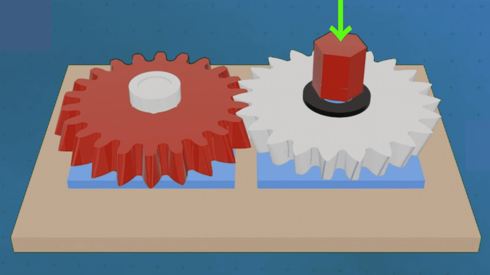

# Conical Involute Gears (Beveloid Gears) for Backlash Reduction

A parametric Lua model for [IceSL Studio](https://icesl.loria.fr/) that generates a pair of straight conical involute gears and a demonstration assembly for exploring backlash reduction through axial adjustment.

The gear geometry follows the analytical rack-generation method described by Jesper Brauer (2002). The script combines sampled involute and root-fillet profiles, synchronized gear positioning, an intersection probe, analytical backlash estimates, and selectable STL export bodies.

## Files and installation

- `beveloid_gear_v2.lua`: gear generator, interactive controls, hardware geometry, assembly, console report, and export selection.
- `README.md`: setup, controls, mathematical model, and implementation notes.

1. Install IceSL Studio.
2. Download or clone this repository.
3. Open `beveloid_gear_v2.lua` in IceSL Studio.
4. Allow the model to rebuild after changing parameters. Use a lower resolution for faster iteration.

## Features

- Independent tooth counts and bottom/top profile shifts for both gears.
- Layer-based polyhedron construction with sampled involutes, rack-generated root fillets, tip arcs, and root arcs.
- Simple and advanced interfaces, with individual-body visibility controls in advanced mode.
- Axial movement of the flipped driven gear, including its shims and threaded cap.
- Gear-ratio-dependent rotation and a separate driven-gear angular offset for probing play.
- Operating centre distance calculated from the mid-face profile shifts, plus adjustable radial clearance.
- Console reporting of engaged width, local profile-shift sum, circumferential and normal backlash, and estimated driven-gear free play.
- Geometric overlap visualization and notes or warnings for selected geometry and assembly conditions.
- Demonstration hardware: shafts with integrated screw-down mounts, keyed shims, threaded caps, snap-pin handle, and a wooden baseplate.
- Nine selectable export bodies.

## Interactive controls

### Basic view

The following controls are created even when `Advanced mode` is disabled:

| Control | Default | Range / behavior |
|---|---:|---|
| `Advanced mode` | Off | Enables geometry controls and mode selection |
| `Check for intersection (backlash probe)` | Off | Displays the overlap of the meshed gear bodies instead of the gears, shims, caps, and handle |
| `Resolution (decrease for performance)` | 10 | 5–50; controls axial layers and sampling of gear-profile curves |
| `Driving Gear Rotation (Anti-Clockwise direction) (deg)` | 0 | 0–90°; drives the synchronized gear pair and handle |
| `Axial offset(mm)` | 0 | 0 to face width minus 1 mm; moves the driven gear downward |
| `Driven Gear angular offset (deg)` | 0 | −2 to +2°; adjusts only the driven gear's angular position |

In the basic view, all assembly-body visibility flags are enabled. The driving rotation and driven angular offset are always available in the implementation, despite the more restricted interface described in the script's introductory comments.

### Advanced geometry controls

| Control | Default | Range / behavior |
|---|---:|---|
| `Module` | 4.0 mm | 1.0–10.0 mm |
| `Normal Pressure Angle (deg)` | 20° | 16–24° |
| `Number of Teeth-Driving Gear` | Automatically selected | Calculated undercut limit to 40 |
| `Number of Teeth-Driven Gear` | Automatically selected | Calculated undercut limit to 40 |
| `Face Width (mm)` | 15.0 mm | 5.0–30.0 mm |
| `Profile Shift Coefficient Bottom-Driving Gear` | 1.0 | −0.3 to 1.0 |
| `Profile Shift Coefficient Top-Driving Gear` | −0.3 | −0.3 to 1.0 |
| `Profile Shift Coefficient Bottom-Driven Gear` | 1.0 | −0.3 to 1.0 |
| `Profile Shift Coefficient Top-Driven Gear` | −0.3 | −0.3 to 1.0 |
| `Fillet Coefficient` | 0.38 | 0.05–0.8; generating-rack tip radius divided by module |
| `Shaft diameter (mm)` | 17.0 mm | 10.0–25.0 mm |
| `Clearance (mm)` | 0.0 mm | 0.0–5.0 mm; added to the calculated centre distance |

The script starts with a requested tooth count of 22, then raises it to the calculated minimum if necessary. With the default 20° normal pressure angle and minimum profile shift of −0.3, both gears use 23 teeth.

### Advanced display and export modes

`Mode selection` provides:

- `Toggle individual bodies`: visibility checkboxes for the driving gear, driven gear, shafts, shims, caps, handle, and wooden plate.
- `STL Export`: a `Select body to export` radio list, described below.

## Usage

### Explore axial backlash adjustment

1. Start with the default geometry and keep the intersection probe disabled to inspect the assembly.
2. Increase `Axial offset(mm)` to move the driven gear downward and increase the engaged face width.
3. Read the console report after each rebuild to compare predicted backlash and engaged width.
4. Use the driving-gear rotation control to inspect different meshing positions.
5. Adjust the driven-gear angular offset to explore clearance on either side of the nominal position.

At zero axial offset, the gears overlap axially by 1 mm. At the maximum offset, their full face widths align. For the default matched tapers, increasing axial offset increases the local profile-shift sum and reduces the analytical backlash at fixed centre distance.

### Inspect geometric overlap

Enable `Check for intersection (backlash probe)` to compute the intersection of the two positioned gear solids. A nonempty intersection is emitted in yellow.

- No visible overlap means no interpenetration was detected at the current angular position and sampling resolution; it does not independently establish the amount of backlash or exact contact.
- A small sliver may indicate near-contact or small interference, but it is not a precise zero-backlash measurement.
- A visible overlap volume indicates geometric penetration of the sampled solids.

The console reports either no intersection or an intersection found. Shafts and the wooden plate are emitted separately and can remain visible while the probe is enabled. To isolate the probe visually, use advanced individual-body mode and turn off `Show Shafts` and `Show Wooden Plate`.

The analytical backlash estimate does not incorporate the driven angular probe offset; that control changes the displayed geometry, not the calculated tooth-space clearance.

## Mathematical model

### Profile shift and cone angle

For each gear, the profile-shift coefficient varies linearly over its local axial coordinate:

\[
x(z) = x_{\mathrm{bottom}} + (x_{\mathrm{top}}-x_{\mathrm{bottom}})\frac{z}{b},
\qquad 0 \le z \le b.
\]

The signed cone angle is:

\[
\delta = \arctan\!\left(\frac{m(x_{\mathrm{top}}-x_{\mathrm{bottom}})}{b}\right).
\]

The transverse pressure angle used in profile generation is:

\[
\alpha_t = \arctan(\tan\alpha_n\cos\delta).
\]

Here, \(m\) is the module, \(b\) is the face width, and \(\alpha_n\) is the normal pressure angle. The driven gear is flipped in the assembly so the tapers face each other.

### Tooth-count safeguard

The preliminary minimum tooth count is:

\[
z_{\min} = \left\lceil\frac{2(1-x_{\min})}{\sin^2\alpha_n}\right\rceil,
\qquad x_{\min}=-0.3.
\]

Both tooth counts are rounded and clamped to this minimum before geometry, centre distance, phase, and gear ratio are calculated. This preliminary check is not a guarantee of undercut-free beveloid geometry: the script also checks individual layers and approximates the fillet/involute junction at the base circle when undercut is detected.

### Operating centre distance

Let \(z_1,z_2\) be the tooth counts and let \(x_{1,\mathrm{mid}},x_{2,\mathrm{mid}}\) be the average end-face profile shifts. With \(\operatorname{inv}(\alpha)=\tan\alpha-\alpha\), using radians:

\[
a_0=\frac{m(z_1+z_2)}{2},
\]

\[
\operatorname{inv}(\alpha_{w,\mathrm{design}})
=\operatorname{inv}(\alpha_t)
+\frac{2\tan\alpha_t(x_{1,\mathrm{mid}}+x_{2,\mathrm{mid}})}{z_1+z_2},
\]

\[
a=a_0\frac{\cos\alpha_t}{\cos\alpha_{w,\mathrm{design}}}+c,
\]

where \(c\) is `Clearance (mm)`. The inverse involute is evaluated using Newton iteration. If the target involute value is nonpositive, the implementation uses the fallback \(a=a_0+m(x_{1,\mathrm{mid}}+x_{2,\mathrm{mid}})+c\) and prints a note.

### Backlash prediction

The script evaluates both local profile shifts at the midpoint of the current axial overlap. At the actual centre distance, it calculates:

\[
\cos\alpha_w=\frac{a_0\cos\alpha_t}{a},
\qquad d_{wi}=\frac{z_i m\cos\alpha_t}{\cos\alpha_w},
\]

\[
s_i=m\left(\frac{\pi}{2}+2x_i\tan\alpha_t\right),
\]

\[
s_{wi}=d_{wi}\left[\frac{s_i}{z_i m}+\operatorname{inv}(\alpha_t)-\operatorname{inv}(\alpha_w)\right],
\]

\[
j_t=\frac{\pi d_{w1}}{z_1}-s_{w1}-s_{w2}.
\]

The console also reports normal backlash \(j_n=j_t\cos\alpha_w\) and estimated driven-gear free play \(j_t/(d_{w2}/2)\), converted to degrees.

- Positive predicted backlash indicates analytical tooth-space clearance.
- Zero indicates nominal analytical clearance closure.
- Negative indicates analytical interference.

The pair calculation uses the driving gear's transverse pressure angle. If the cone angles differ, the script prints a note; the midpoint estimate should not be interpreted as a full face-width contact analysis. If the operating-angle calculation is invalid because its cosine is at least one, the backlash result is omitted.

## Assembly hardware

The script models:

- A driving shaft with an enlarged support hub and integrated mounting block.
- A driven shaft with a keyway, threaded adjustment region, and integrated mounting block.
- Two keyed shims above and below the driven gear.
- Driving and driven threaded caps; the driven cap rotates as it moves axially.
- A snap-pin handle and matching hole in the driving gear.
- A 210 × 148 × 9 mm wooden baseplate.

The mounts include four countersunk holes each. The screw-shaped solids are hole cutters, not separately emitted fasteners. The compressed spring height is represented by an 8 mm assembly offset; a spring solid is not generated.

Several hardware settings are fixed constants in Section 1 rather than UI controls, including the 3 mm shim thickness, fit clearances, key width, mount dimensions, and baseplate size. Threads use rotating offset-circle sections rather than a standardized fastener profile. The configured angular progression is 100°/mm, corresponding to a nominal 3.6 mm pitch.

## STL export

1. Enable `Advanced mode`.
2. Set `Mode selection` to `STL Export`.
3. Disable the intersection probe to avoid adding its output to the selected export body.
4. Choose a part in `Select body to export`.
5. Use IceSL's `File > Export` workflow to save the selected geometry as STL.
6. Repeat for the remaining parts as needed.

| Selector | Body |
|---:|---|
| 0 | Driving gear |
| 1 | Driven gear |
| 2 | Driving gear shaft, including mount and support hub |
| 3 | Driven gear shaft, including mount |
| 4 | Shim |
| 5 | Driving gear cap |
| 6 | Driven gear cap |
| 7 | Handle |
| 8 | Wooden plate |

The export branch flips the driven gear and both caps by 180° about X. It does not consistently centre parts or place their lowest point at Z = 0, so inspect orientation and placement before slicing.

Implementation note: the shim export emits `shim`, the plain annular spacer, whereas the assembly uses `shim_slotted`, which includes the anti-rotation key. Exporting the keyed version requires changing the shim export branch to emit `shim_slotted`.

## Console diagnostics and limitations

The console summarizes tooth counts, module, pressure angles, centre distance, axial overlap, local profile shifts, predicted backlash, and estimated free play. Depending on the parameters, it also reports:

- Different cone angles and resulting face-width variation in backlash.
- Undercut layers and the approximate fillet-junction fallback.
- A fallback centre-distance calculation.
- Tip/root interference at the sampled mesh plane.
- A shaft bore approaching or cutting into the tooth-root region.
- A handle hole overlapping the shaft bore or breaking into the hub recess.
- Small mounting blocks or an assembly exceeding the baseplate dimensions.

Resolution controls the sampled gear geometry, not all hardware discretization: thread-section density and thread-circle sampling are fixed separately. Higher resolution can improve the mesh approximation but increases rebuild cost.

This is a geometric design and visualization demonstrator, not a loaded contact, deformation, stress, wear, or manufacturing-tolerance simulation. Analytical estimates, sampled intersections, and console warnings should be evaluated together; none alone guarantees a bind-free printed assembly.

## Script structure

| Section | Purpose |
|---:|---|
| 0 | Overview and usage comments |
| 1 | Colours and fixed constants |
| 2 | UI parameters and display modes |
| 3 | Mathematical and array helpers |
| 4 | Rack-generated beveloid gear construction |
| 5 | Mounts, threads, shafts, caps, snap pin, and handle |
| 6 | Centre distance and backlash prediction |
| 7 | Assembly, output, console report, and export selection |

## Reference

Brauer, Jesper. (2002). *Analytical geometry of straight conical involute gears*. Mechanism and Machine Theory, 37(2), 127–141. DOI: [10.1016/S0094-114X(01)00062-3](https://doi.org/10.1016/S0094-114X(01)00062-3).

## Authors and team

Development: Team 37.

Created for research and design exploration of precision gear drives with axial backlash adjustment using IceSL.
